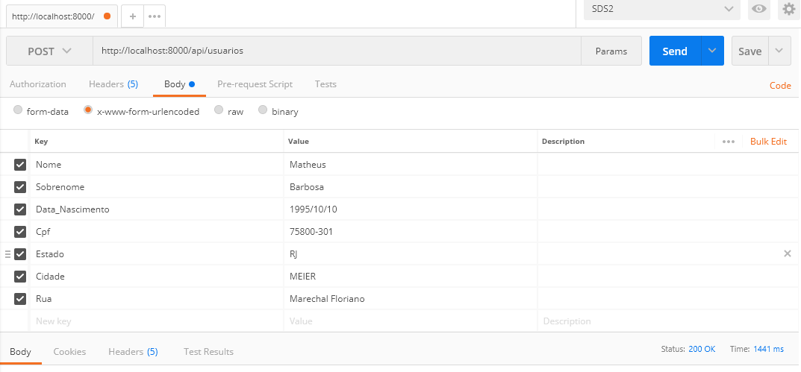

## Startando o projeto

1) Use o comando <strong>composer install</strong> para baixar as dependências.
2) Use a url - GET http://SEUDOMINIO/public_html/api/migration/ para criar o banco e as tabelas do projeto.

Obs:Caso não consiga criar o banco pela url,deixei o arquivo sql na raiz do projeto =)

## Fazendo as requisições

 - Utilizei o Apache(xampp) para receber as requisições.
 - Utilizei o postman para enviar as requisiçoes

## API Usuario

  GET - Retornar todos os usuarios: http://SEUDOMINIO/public_html/api/usuario/

  GET - Retornar um usuario especifico: http://SEUDOMINIO/public_html/api/usuario/{idDesejado}/

  POST - Adicionar usuario e endereço do usuario ao banco de dados http://SEUDOMINIO/public_html/api/usuarios/
    Exemplo: </img>

  PUT - Modificar usuario no banco de dados http://SEUDOMINIO/public_html/api/usuario/{idDesejado}/

  DELETE - Excluir um usuario especifico http://SEUDOMINIO/public_html/api/usuario/{idDesejado}/
 
  DELETE - Deletar todos os usuarios http://SEUDOMINIO/public_html/api/usuario/{idDesejado}/
    <strong style="color:red">Obs: Apagando o usuario,consequentemente apagara os endereços anexados a eles.</strong>

  Observação:Se você excluir um usuario,todos os endereços atrelhados a ele também serão excluidos.
## API ENDERECO

  DELETE - Excluir um endereco especifico http://SEUDOMINIO/public_html/api/endereco/{idDesejado}

  DELETE - Deletar todos os enderecos http://SEUDOMINIO/public_html/api/endereco/

  PUT - Modificar Endereco do usuario ao banco de dados http://SEUDOMINIO/public_html/api/endereco/{idDesejado}/

  GET - Retorna todas as cidades cadastradas http://SEUDOMINIO/public_html/api/cidades/

  GET - Retorna uma cidade especifica http://SEUDOMINIO/public_html/api/cidades/{idDesejado}

  GET - Retorna todos os estados cadastrados http://SEUDOMINIO/public_html/api/estados/

  GET - Retorna um Estado especifico http://SEUDOMINIO/public_html/api/estados/{idDesejado}

  GET - Retorna o total de usuários cadastrados por cidade ou estado as cidades cadastradas 
  http://SEUDOMINIO/api/public_html/total/{EstadoOuCidade}

    Exemplo: {EstadoOuCidade} = Rj ou Guadalupe